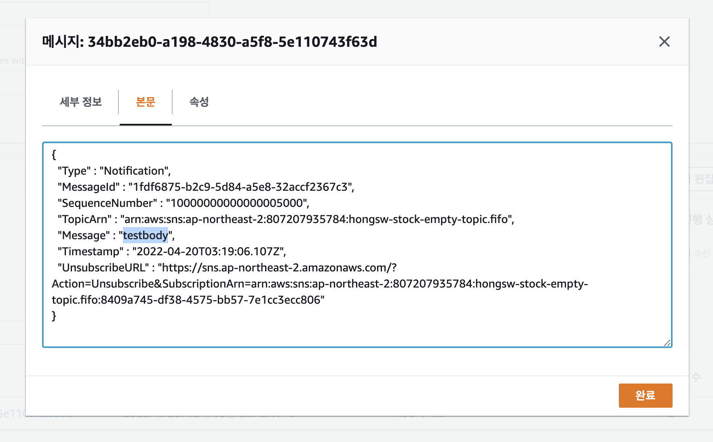

## sqs에서 sns 토픽 구독 설정


## sns에서 test 메시지 보내기


## sqs에서 test 메시지 받은 것 확인하기


## node.js lambda로 sns 메시지 만들기

테스트를 위해서 1번째 단계인 메시지를 생성해서 SQS가 구독하는 단계까지 진행


FILL_ME_IN을 채워넣거나, 환경변수로 분리해서 실행하세요.

```sh
$ node ./index.js


SNS App listening on port 3000!
{
  MessageGroupId: 'stock-empty-group',
  subject: '부산도너츠 재고 부족',
  message: '재고 부족',
  MessageAttributeProductId: 'CP-502101',
  MessageAttributeFactoryId: 'FF-500293'
}
{
  ResponseMetadata: { RequestId: '940bf151-3fbe-55f5-ad83-ab8d5f8eec3f' },
  MessageId: '7352a88d-dc59-5a75-9190-f251bc6953bf',
  SequenceNumber: '10000000000000028000'
}


```

## 재고 부족 상태에서 바로 토픽을 보내는 방법

```sh
$ curl --location --request POST 'http://localhost:3000/send' \
--header 'Content-Type: application/json' \
--data-raw '{
    "MessageGroupId": "stock-empty-group",
    "subject": "부산도너츠 재고 부족",
    "message": "재고 부족",
    "MessageAttributeProductId": "CP-502101",
    "MessageAttributeFactoryId": "FF-500293"
}'
```