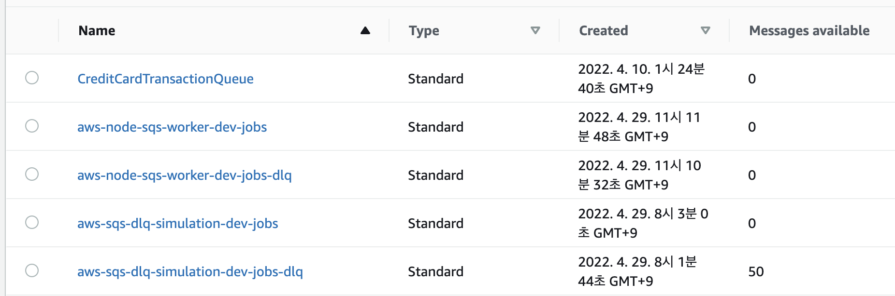

# Step-2: Dead Letter Queue(DLQ) 연습

`Day 1-Step 2`에서 만든 인프라에 Dead Letter Queue(DLQ)을 추가 해봅시다.
## 1. DLQ 설정하기 

방법은 여러가지 입니다만, 콘솔에서 설정도 가능하고 아래와 같이 AWS-SDK를 실행해서 설정할 수도 있습니다.

코드로 설명 : 
https://github.com/awsdocs/aws-doc-sdk-examples/blob/main/javascriptv3/example_code/sqs/src/sqs_deadletterqueue.js
참고하여 데드레터큐 설정하는 코드를 작성하고 실행해보자 

## 2. DLQ 발생 상황 만들기
handler-long-polling.js
코드배포를 Serverless Framework로 배포하자.

## 3. k6를 이용해 요청을 보내서 실패한 메시지가 DLQ에 쌓이는지 확인
k6로 2단계 배포된 endpoint에 테스트 해서 실패한 메시지가 DLQ에 쌓이는지 확인해보자

0. 어느날 B업무 정책회의를 하였다.

1. B업무를 진행하는, 컨슈머 람다의 알고리즘이 30초 이상이면 실패로 간주한다. 라고 개발자와 운영자가 정하였다.
    (각 요청에 따른 람다내용을 보고 오래 걸리는 것이라고 생각하면 되지만, 알고리즘이 수렴하지 않고 발산할 경우 알고리즘 처리시간이 오래 걸릴 수 있다)

2. 따라서, sqs에 visibility timeout (가시성 메시지 타임아웃시간)를 3초로 설정 한다. 

3. 30초 동안 5개의 maxReceiveCount 설정을 해주고, maxReceiveCount가 5번이 넘으면 메시지를 메시지를 위에서 정의한대로 실패로 간주되어 데드레터큐에 저장된다.
    - 참조 : sqs_deadletterqueue.js

4. 저장한 메시지는 운영자가 세부 문제를 직접 수작업으로 파악한다. 

5. 이를 테스트 하기 위해서, 20초 동안 메시지를 10개를 보낸다, 50%는 30초 롤폴링을 30초 동안 진행되도록 설정하고, 나머지는 바로 응답을 준다.

6. 결과로, 1,2*,3,4*,5,6*,7,8*,9,10* 짝수만 30초동안 롤폴링을 진행하며, 홀수는 바로 응답을 준다.
 그러면 순서대로 데드레터큐에 저장된 메시지는 이렇게 나열된다.
 2,4,6,8,10

## 4. (advanced) 재시도 정책
https://github.com/aws-samples/amazon-sqs-dlq-replay-backoff
재시도를 정책까지 포함하여 데드레터큐를 사용하여 데이터를 재시도하는 방법을 알아보자.

## 참조 

왜 52개 들어가는지 고민해보자 